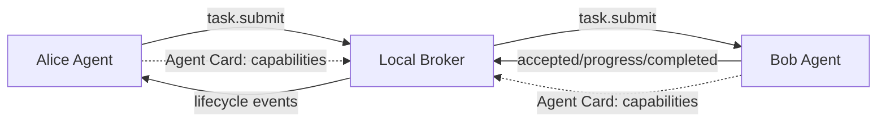

# LatticeAG PolyMesh 🌐

<p align="center">
  <a href="https://github.com/LatticeAG/PolyMesh/blob/main/LICENSE">
    
  </a>
  <a href="https://github.com/LatticeAG/PolyMesh/actions/workflows/ci-full.yml">
    
  </a>
  <a href="https://github.com/LatticeAG/PolyMesh/actions/workflows/release.yml">
    
  </a>
  <a href="https://github.com/LatticeAG/PolyMesh/stargazers">
    
  </a>
  <a href="https://github.com/LatticeAG/PolyMesh/issues">
    
  </a>
  <a href="https://github.com/LatticeAG/PolyMesh">
    
  </a>
  <a href="https://github.com/LatticeAG/PolyMesh">
    
  </a>
  <a href="https://www.python.org/">
    
  </a>
</p>

<blockquote>
<p><strong>MCP gave agents tools. A2A gave agents a phone book. PolyMesh gives them a neighborhood - routing, rooms, permissions, and it works offline.</strong></p>
</blockquote>

<p align="center">
  Local-first agent mesh. TypeScript + Python. Internet optional.
</p>

<p align="center">
  <a href="#quick-start">Quick Start</a> ·
  <a href="#packages">Packages</a> ·
  <a href="#speak-a2a-wire-vs-product">Speak A2A</a> ·
  <a href="docs/positioning.md">Positioning</a> ·
  <a href="#offline-re-route-demo">Offline demo</a> ·
  <a href="#how-it-works">How It Works</a> ·
  <a href="#architecture">Architecture</a>
</p>

---

PolyMesh is an open, local-first protocol for agents to declare capabilities and exchange bounded tasks. Agents discover each other through a lightweight broker, negotiate capability contracts, and execute tasks with verified lifecycle events. No cloud required for the local path.

Built as the LatticeAG Poly series protocol layer. Works with any framework, any language, any runtime.

Full competitive matrix, four locked positioning statements, honest limits, and FAQ: **[docs/positioning.md](docs/positioning.md)**.

## Quick Start

```bash
# Create a new project from the starter template
npx @latticeag/create-polymesh-app my-agents
cd my-agents
npm install
npm run demo
```

The demo starts a local broker and client, exchanges a safe ping/pong, and exits cleanly.

For a process-boundary demonstration with multiple agents:

```bash
docker compose up --build
```

It prints the broker, Alice, and Bob lifecycle and exits when Alice receives Bob's echo result.

> **Experimental software**: Review [SECURITY.md](SECURITY.md) before exposing a listener or allowing any side-effecting capability. PolyMesh does not provide a hosted relay in this repository.

## Packages

| Package | Layer | Purpose | Language |
| --- | --- | --- | --- |
| `@latticeag/polymesh-broker` | PRODUCT | WebSocket broker and local registry | TypeScript |
| `@latticeag/polymesh-client` | PRODUCT | Client SDK, CLI, capability router | TypeScript |
| `@latticeag/polymesh-a2a` | WIRE (leaf dialect) | A2A adapter; ships with M5 | TypeScript |
| `@latticeag/polymesh-gateway` | WIRE / relay | Blind native REST/SSE/WSS relay | TypeScript |
| `@latticeag/create-polymesh-app` | app | Starter generator for the ping/pong example | TypeScript |
| `latticeag-polymesh` | PRODUCT | Python SDK; import as `polymesh` | Python |

PRODUCT owns routing, rooms, permissions, task lifecycle, and local-first runtime. WIRE speaks standards as dialects at the leaf. The gateway stays a blind pipe.

## Speak A2A (WIRE vs PRODUCT)

> We don't compete with A2A. We speak it. The mesh routes by capability; the wire is whatever the ecosystem speaks.

| Layer | What it is | PolyMesh role |
| --- | --- | --- |
| STANDARDS | A2A, MCP, ACP | Adopted. Never competed with. |
| WIRE | Native envelopes + A2A JSON-RPC as a dialect | Leaf translation in `@latticeag/polymesh-a2a` / `polymesh-a2a` |
| PRODUCT | Capability routing, rooms, permissions, offline re-route | Where PolyMesh differentiates |

A2A WIRE is point-to-point. Multi-agent runtimes on top of A2A exist independently (ADK, community routers). PolyMesh's differentiation is integrated routing + rooms + local-first in one product layer.

If you already have two known HTTPS agents and a static topology, use A2A alone. Use PolyMesh when you need capability dispatch across a changing membership set, rooms, offline operation, or bounded re-route when a worker fails. Details: [docs/positioning.md](docs/positioning.md).

### Short comparison

| Capability | PolyMesh | A2A | ACP | AgentChat | Caspian |
| --- | --- | --- | --- | --- | --- |
| Agent-to-agent | YES | YES | n/a (UI) | YES | no (A2H) |
| Capability-based routing | YES | no (address) | n/a | no (address) | no |
| Multi-agent topology / rooms | YES | no (wire P2P; runtimes on top exist) | n/a | DMs + @mention groups; no capability re-route; hosted | no |
| Local-first, offline | YES | no (needs endpoints) | n/a | no (hosted) | no |
| Structured task lifecycle | YES | YES (endpoint-local); distributed re-route n/a | n/a | chat | no |
| Interops with A2A | YES (v6 spec; ships with M5) | native | n/a | via A2A | via A2A |

Bold product-layer cells are the only fair "we win" claims. Full matrix + evidence: [docs/positioning.md](docs/positioning.md).

## Offline re-route demo

Three agents on a laptop, no internet. One drops mid-task. The mesh re-routes to a peer with the same capability. Zero config, no public endpoints.

```bash
./scripts/demo-offline-reroute.sh
```

This is also an executable conformance test (`tests/demo-offline-reroute.test.ts`) that asserts all nine §D.3.6 observations in order. See [scripts/offline-reroute/README.md](scripts/offline-reroute/README.md).

The TypeScript CLI is provided by `@latticeag/polymesh-client`:

```bash
npx @latticeag/polymesh-client help
```

Configuration is TOML-based, read from `~/.config/polymesh/config.toml` by default. Use `POLYMESH_CONFIG` or `--config FILE` to select another file:

```bash
npx @latticeag/polymesh-client config show
```

## How It Works



Each agent publishes an **Agent Card** with its identity and capability contracts. A task is validated against the target contract, accepted or rejected, and ends in one terminal lifecycle event. The broker routes tasks between agents using registered capabilities, not hardcoded addresses.

### Core Protocol Flow

| Phase | Description |
|-------|------------|
| **Discovery** | Agents announce capabilities via broker registry or opt-in mDNS hints |
| **Handshake** | Capability negotiation and profile selection (`polymesh` v0.1 or `polymesh.0.2` native) |
| **Task Submission** | Validated task envelope with contract-aligned payload |
| **Lifecycle** | Accepted -> progress events -> terminal completion or rejection |
| **Compression** | Optional zstd framing for `polymesh.0.2` native profile |

## Configuration Precedence

The TypeScript CLI merges settings in this order:

```
defaults < TOML config file < environment variables < command-line flags
```

Supported TOML sections are `[broker]`, `[client]`, and `[discovery]`. Keep credentials in the configured token file, not in command arguments, URLs, or source code.

## Support Matrix

| Capability | Status in v0.5.0 | Notes |
| --- | --- | --- |
| v0.1 local task lifecycle | Supported | TypeScript broker/client and Python SDK are covered by shared compatibility vectors |
| `polymesh.0.2` native SDK profile | Experimental | Explicit opt-in with profile negotiation and optional zstd framing |
| v2 gateway REST/SSE adapter | Experimental, loopback-only | Node reference adapter for local `/v2/tasks` and `/v2/events` |
| mDNS discovery | TypeScript supported, Python pending | Opt-in, WSS-only; hint-based, never auto-enrollment |
| Remote transport | Explicitly configured WSS only | Mutual enrollment and TLS requirements fail closed |
| Docker Compose demo | Supported local fixture | Repeatable development demo, not production architecture |
| DeckAgent carrier | Client-side experimental | No production DeckAgent service or relay deployment |

### Profile Support

| Profile | TypeScript | Python | Security Boundary |
| --- | --- | --- | --- |
| Numeric-loopback dev WebSocket | Supported | Supported (v0.1) | Local development only; never bridge across LAN/Internet |
| `polymesh.0.2` native profile | Experimental explicit opt-in | Experimental explicit opt-in | Scoped to selected broker mesh |
| Enrolled WSS | Supported | Not advertised as general secure-carrier | Mutual enrollment and TLS fail closed |
| mDNS WSS discovery hints | Supported, opt-in | Optional dependency | Discovery conveys no trust, never initiates enrollment |
| Hosted/remote relay | Not available | Not available | Planned separately |

## Verification

The v0.5.0 release gate runs clean installs, TypeScript type checking/build/tests, Python tests/builds, package artifact smoke tests, and shared compatibility fixtures.

From a source checkout:

```bash
npm ci
npm run typecheck
npm test
npm run build

uv sync --dev
uv run pytest -q
uv build
```

## Architecture

For the full architectural overview and dependency graph, see [ARCHITECTURE.md](ARCHITECTURE.md).

### Test Report

36 TypeScript test suites (181 tests) + 69 Python tests pass against a shared compatibility vector suite that covers both v0.1 and `polymesh.0.2` profiles. See [TEST-REPORT.md](TEST-REPORT.md) for detailed coverage.

## Scope and Limitations

PolyMesh does **not** claim:

- A competing wire format, or "A2A alternative / killer"
- Hosted DM identity / WhatsApp-for-agents (AgentChat's lane)
- Editor UI protocol leadership in v6 (ACP deferred to v7)
- Agent-to-human channel suite (Caspian's lane)
- Generic end-to-end envelope signing or delegated authorization grants
- Continuous task-output streaming or generic pub/sub
- A hosted Worker relay inside this repository (see [polymesh-gateway](https://github.com/LatticeAG/polymesh-gateway))

Gateway SSE is task-event observation, not general streaming or a topic system.

Messaging bans and reviewer checklist: [docs/positioning.md](docs/positioning.md#messaging-bans).

## Development Feedback

When reporting an issue, include the package versions, selected profile, redacted command output, and a minimal reproduction. Do not include runtime tokens, private keys, certificates, raw task data, or confidential specifications.

## License

PolyMesh is released under the [MIT License](LICENSE). Built by [LatticeAG](https://github.com/LatticeAG).

---

### PolyMesh Gateway

Want to take PolyMesh beyond localhost? The [**PolyMesh Gateway**](https://github.com/LatticeAG/polymesh-gateway) is a Cloudflare Workers relay platform that connects agents across the internet.

- **Agent meshes** — join named rooms with invite codes. Friends, dev teams, personal agents.
- **Capability discovery** — find peers by what they can do, not just by address.
- **Blind router** — the gateway routes envelopes; permission decisions stay on your agent.
- **Free-tier CF** — Workers + D1 + Durable Objects. No infra costs for small meshes.
- **Direct WSS** — each agent connects its own socket. No broker bridge needed.

```bash
# Boot a gateway relay
npx wrangler deploy

# From your agent (using the v5 SDK)
client.connectGateway({ apiKey: "pmgk_...", gatewayUrl: "wss://your-gateway.example.com" })
```

See the [polymesh-gateway repo](https://github.com/LatticeAG/polymesh-gateway) for deployment, API docs, and full protocol spec.