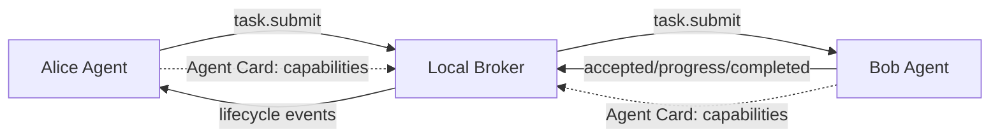

# LatticeAG PolyMesh 🌐

<p align="center">
  <a href="https://github.com/LatticeAG/PolyMesh/blob/main/LICENSE">
    
  </a>
  <a href="https://github.com/LatticeAG/PolyMesh/actions/workflows/ci-full.yml">
    
  </a>
  <a href="https://github.com/LatticeAG/PolyMesh/actions/workflows/release.yml">
    
  </a>
  <a href="https://github.com/LatticeAG/PolyMesh/stargazers">
    
  </a>
  <a href="https://github.com/LatticeAG/PolyMesh/issues">
    
  </a>
  <a href="https://github.com/LatticeAG/PolyMesh">
    
  </a>
  <a href="https://github.com/LatticeAG/PolyMesh">
    
  </a>
  <a href="https://www.python.org/">
    
  </a>
</p>

<p align="center">
  <b>An open protocol for agent-to-agent communication.</b><br/>
  Local-first, framework-agnostic, internet-optional.
</p>

<p align="center">
  <a href="#quick-start">Quick Start</a> ·
  <a href="#packages">Packages</a> ·
  <a href="#how-it-works">How It Works</a> ·
  <a href="#support-matrix">Support Matrix</a> ·
  <a href="#verification">Verification</a> ·
  <a href="#architecture">Architecture</a>
</p>

---

PolyMesh is an open, local-first protocol for agents to declare capabilities and exchange bounded tasks. Agents discover each other through a lightweight broker, negotiate capability contracts, and execute tasks with verified lifecycle events -- no cloud required.

Built as the LatticeAG Poly series protocol layer. Works with any framework, any language, any runtime.

## Quick Start

```bash
# Create a new project from the starter template
npx @latticeag/create-polymesh-app my-agents
cd my-agents
npm install
npm run demo
```

The demo starts a local broker and client, exchanges a safe ping/pong, and exits cleanly.

For a process-boundary demonstration with multiple agents:

```bash
docker compose up --build
```

It prints the broker, Alice, and Bob lifecycle and exits when Alice receives Bob's echo result.

> **Experimental software**: Review [SECURITY.md](SECURITY.md) before exposing a listener or allowing any side-effecting capability. PolyMesh does not provide a hosted relay in this repository.

## Packages

| Package | Purpose | Language |
| --- | --- | --- |
| `@latticeag/polymesh-broker` | WebSocket broker and local registry | TypeScript |
| `@latticeag/polymesh-client` | Client SDK, CLI, and constrained mDNS discovery | TypeScript |
| `@latticeag/polymesh-gateway` | REST/SSE gateway reference adapter | TypeScript |
| `@latticeag/create-polymesh-app` | Starter generator for the ping/pong example | TypeScript |
| `latticeag-polymesh` | Python SDK; import as `polymesh` | Python |

The TypeScript CLI is provided by `@latticeag/polymesh-client`:

```bash
npx @latticeag/polymesh-client help
```

Configuration is TOML-based, read from `~/.config/polymesh/config.toml` by default. Use `POLYMESH_CONFIG` or `--config FILE` to select another file:

```bash
npx @latticeag/polymesh-client config show
```

## How It Works



Each agent publishes an **Agent Card** with its identity and capability contracts. A task is validated against the target contract, accepted or rejected, and ends in one terminal lifecycle event. The broker routes tasks between agents using registered capabilities, not hardcoded addresses.

### Core Protocol Flow

| Phase | Description |
|-------|------------|
| **Discovery** | Agents announce capabilities via broker registry or opt-in mDNS hints |
| **Handshake** | Capability negotiation and profile selection (`polymesh` v0.1 or `polymesh.0.2` native) |
| **Task Submission** | Validated task envelope with contract-aligned payload |
| **Lifecycle** | Accepted -> progress events -> terminal completion or rejection |
| **Compression** | Optional zstd framing for `polymesh.0.2` native profile |

## Configuration Precedence

The TypeScript CLI merges settings in this order:

```
defaults < TOML config file < environment variables < command-line flags
```

Supported TOML sections are `[broker]`, `[client]`, and `[discovery]`. Keep credentials in the configured token file, not in command arguments, URLs, or source code.

## Support Matrix

| Capability | Status in v0.4.0 | Notes |
| --- | --- | --- |
| v0.1 local task lifecycle | Supported | TypeScript broker/client and Python SDK are covered by shared compatibility vectors |
| `polymesh.0.2` native SDK profile | Experimental | Explicit opt-in with profile negotiation and optional zstd framing |
| v2 gateway REST/SSE adapter | Experimental, loopback-only | Node reference adapter for local `/v2/tasks` and `/v2/events` |
| mDNS discovery | TypeScript supported, Python pending | Opt-in, WSS-only; hint-based, never auto-enrollment |
| Remote transport | Explicitly configured WSS only | Mutual enrollment and TLS requirements fail closed |
| Docker Compose demo | Supported local fixture | Repeatable development demo, not production architecture |
| DeckAgent carrier | Client-side experimental | No production DeckAgent service or relay deployment |

### Profile Support

| Profile | TypeScript | Python | Security Boundary |
| --- | --- | --- | --- |
| Numeric-loopback dev WebSocket | Supported | Supported (v0.1) | Local development only; never bridge across LAN/Internet |
| `polymesh.0.2` native profile | Experimental explicit opt-in | Experimental explicit opt-in | Scoped to selected broker mesh |
| Enrolled WSS | Supported | Not advertised as general secure-carrier | Mutual enrollment and TLS fail closed |
| mDNS WSS discovery hints | Supported, opt-in | Optional dependency | Discovery conveys no trust, never initiates enrollment |
| Hosted/remote relay | Not available | Not available | Planned separately |

## Verification

The v0.4.0 release gate runs clean installs, TypeScript type checking/build/tests, Python tests/builds, package artifact smoke tests, and shared compatibility fixtures.

From a source checkout:

```bash
npm ci
npm run typecheck
npm test
npm run build

uv sync --dev
uv run pytest -q
uv build
```

## Architecture

For the full architectural overview and dependency graph, see [ARCHITECTURE.md](ARCHITECTURE.md).

### Test Report

36 TypeScript test suites (181 tests) + 69 Python tests pass against a shared compatibility vector suite that covers both v0.1 and `polymesh.0.2` profiles. See [TEST-REPORT.md](TEST-REPORT.md) for detailed coverage.

## Scope and Limitations

PolyMesh v0.4.0 does **not** claim:

- Generic end-to-end envelope signing or delegated authorization grants
- Continuous task-output streaming or generic pub/sub
- Automatic multi-hop routing or MCP/framework adapters
- A hosted Worker relay or production hosting

Gateway SSE is task-event observation, not general streaming or a topic system.

## Development Feedback

When reporting an issue, include the package versions, selected profile, redacted command output, and a minimal reproduction. Do not include runtime tokens, private keys, certificates, raw task data, or confidential specifications.

## License

PolyMesh is released under the [MIT License](LICENSE). Built by [LatticeAG](https://github.com/LatticeAG).